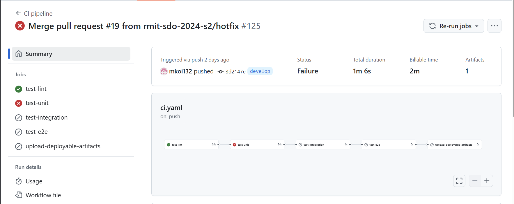
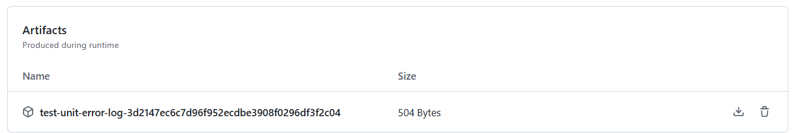
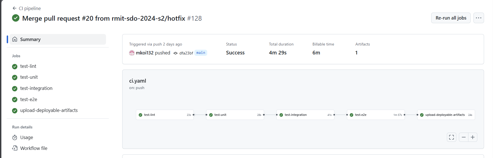
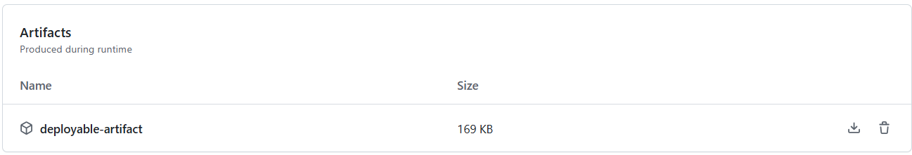
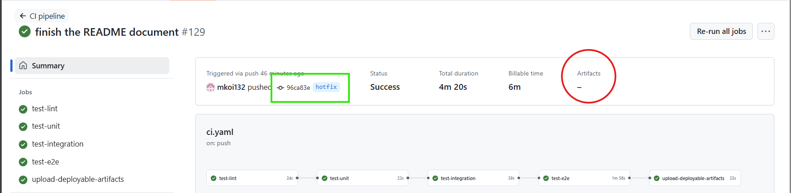

# This Github Action CI pipeline automate the testing of the note taking application, </br> and generate a deployable artifact from the code which pass all tests

## Overview
- [Pipeline Jobs](#pipeline-jobs)
  - [1. Lint Tests (`test-lint`)](#1-lint-tests-test-lint)
  - [2. Unit Tests (`test-unit`)](#2-unit-tests-test-unit)
  - [3. Integration Tests (`test-integration`)](#3-integration-tests-test-integration)
  - [4. End-to-End Tests (`test-e2e`)](#4-end-to-end-tests-test-e2e)
  - [5. Upload Deployable Artifacts (`upload-deployable-artifacts`)](#5-upload-deployable-artifacts-upload-deployable-artifacts)
- [Pipeline Execution Triggers](#pipeline-execution-triggers)
- [Pipeline Outcomes](#pipeline-outcomes)
- [How to Handle Failures](#how-to-handle-failures)

## Pipeline Jobs

### 1. Lint Tests (`test-lint`)

- **Description**: This job runs ESLint to check the code for any syntax errors.
- **Requirements**: eslint test configured and `test-lint` is scripted `package.json` to run the test file.
- **Failure Condition**: If ESLint return any error code other than 0, the pipeline will fail at this stage.
- **Outcome**: 
  + **On Success**: The pipeline proceeds to the text job: unit testing.
  + **On Failure**: The workflow will break as soon as the test fails. A report of running log will be generated and uploaded under the workflow run as an artifact.

### 2. Unit Tests (`test-unit`)

- **Description**: This job runs unit tests configured using Jest on functions of note taking app, and return test results together with test coverage.
- **Requirements**: Unit tests and mocking conditions is well defined in `src/tests/unit/~` `test-unit` command is scripted in `package.json` to peform the test. It also requires the Lint Test job to be passed before jobs of this test could run.
- **Failure Condition**: If any of the unit tests fail (Jest return an exit code other than 0), the pipeline will break and mark this job as fail.
- **Outcome**:
  + **On Success**: The pipeline continue to the next job: integration testing.
  + **On Failure**: The workflow will break as soon as the test fails. A report of running log will be generated and uploaded under the workflow run as an artifact.

### 3. Integration Tests (`test-integration`)

- **Description**: This job runs integration tests to verify that MongoDB and the note application features work well together as expected.
- **Requirements**: test is well defined in `src/tests/integration/~`, `test-integration` command is scripted in `package.json` to peform the test . It also requires the Unit Test job to be passed before jobs of this test could run. A running mongodb instance is required before executing the test step.
- **Failure Condition**: If any of the step fails, including the `test-integration` step, the pipeline will break and mark this job as failed.
- **Outcome**:
  - **On Success**: The pipeline proceeds to E2E testing job.
  - **On Failure**: The workflow will break as soon as a step fails. A report of running log will be generated and uploaded under the workflow run as an artifact.

### 4. End-to-End Tests (`test-e2e`)

- **Description**: This job runs the application on playwright browser, perform end-to-end tests to simulate user interactions and validate that the entire application works as intended from start to finish.
- **Requirements**: test is well defined in `src/tests/e2e/~`, `test-e2e` command is scripted in `package.json` to run the configured playwright browser and perform the test. It also requires the Integration Test job to be passed before jobs of this test could run. A running mongodb instance, and playwright browser installed, are required before executing the test step.
- **Failure Condition**: If any of the jobs fails, including the `test-e2e`, the pipeline will break and mark this job as failed.
- **Outcome**:
  - **On Success**: The pipeline proceeds to upload deployable artifacts.
  - **On Failure**: The workflow will break as soon as a step fails. A report of running log will be generated and uploaded under the workflow run as an artifact.

### 5. Upload Deployable Artifacts (`upload-deployable-artifacts`)

- **Description**: This job re-initiate the application on a new environemnt, generate and upload a deployable artifact of the application, excluding non-essential parts and files component like `node_modules`, `tests`, `coverage`, and `error reports`.
- **Requirements**: This job is run only if all jobs before it has pass (i.e. all tests passed), and the pipeline doesn't break. However, the artifact is only generated and uploaded if the pipeline is being run on the `main` branch of the repository.
- **Failure Condition**: N/A
- **Outcome**:
  + **When run on `main` branch**: A deployable artifact of the application is generated, and uploaded under the workflow run.
  + **When run on other branches**: This job would still pass but not generating any artifact.


## Pipeline Triggers

The pipeline is triggered and run automatically on any *push* event to any branch.

## Pipeline Outcomes

- **Pass**: A successfull workflow run of the pipeline indicates that all required testings are successfully run and passed for the pushed code commit. Plus, a deployable atrifact of application if triggered on `main` branch
- **Fail**: If any job fails (lint, unit, integration, or E2E tests), the pipeline will break with a *fail* status, Plus, a report will be uploaded for further investigation.

### Example of workflow failure of `unit test` job
*A workflow run of this pipeline could be accessbible by visiting [Github Action tab](https://github.com/mkoi132/ActionRunner/actions)*



1. **Workflow status**: The status for this workflow run is *fail* and the *unit test* job is clearly indicated as the failure factor
2. **Worflow artifact**: We notice an artifact for this workflow run has be uploaded as per pipeline configuration. This artifact should contain the output log of the command which make this job fail.



3. **Analyse the error log**: This report of error log shows that the job fail when it try to execute the command `jest --ci tests/unit --coverage --forceExit`, which is scripted for `test-unit`. It also indicate that the test unit covers 100% of written codes. That way we know to check the test file, and that no feature of the application is not tested.

      ```
        > notes@1.0.0 test-unit
        > jest --ci tests/unit --coverage --forceExit

        ----------|---------|----------|---------|---------|-------------------
        File      | % Stmts | % Branch | % Funcs | % Lines | Uncovered Line #s 
        ----------|---------|----------|---------|---------|-------------------
        All files |     100 |      100 |     100 |     100 |                   
        note.js  |     100 |      100 |     100 |     100 |                   
        ----------|---------|----------|---------|---------|-------------------

      ```

4. **Re-run the Pipeline**: Once the issue is fixed, the pipeline will be automatically triggered on push.</br>If the new changes pass the written test file, we will recieve a *pass* status check, and no artifact will be given as the workflow continue to run.

### Example of workflow success on `main` branch
Status check of evry workflow run is accessible from *[Github Action tab](https://github.com/mkoi132/ActionRunner/actions).*
As specified, any sucessfull workflow triggered on `main` branch will generate a deployable artifact,</br>
this artifact is combination of the code which passed the workflow test run, with non-essential development part removed.



Generated deployable artifact could be downloaded(and deployed).



### Example of workflow success on any other branches
Status check of evry workflow run is accessible from *[Github Action tab](https://github.com/mkoi132/ActionRunner/actions).*
As specified, any sucessfull workflow triggered on any other branches other than `main` branch should not generate nor upload any artifact.

This shows an explample of workflow running on `hotfix` branch for commit `96c383e`. We notice **NO** artifact generated from the workflow run.




